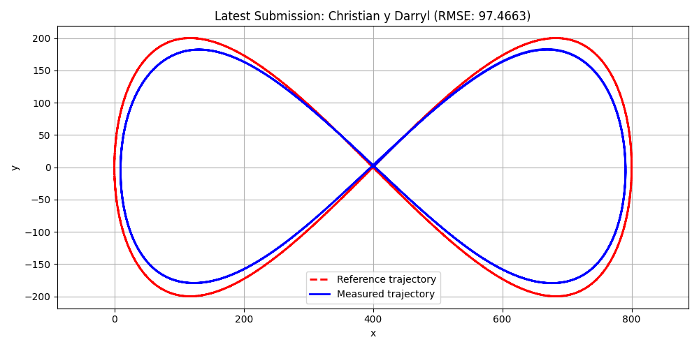

# EV3 Grading Results

This repo uses GitHub Actions and Python to auto-grade student submissions.

## Results

<!-- RESULTS_TABLE_START -->
| Student | Performance Index | Grade |
|---------|-------------------|-------|
| template student | 0.0004 | 9.99 |
| template student | 6.7057 | 8.00 |
| template student | 6.7057 | 8.00 |
| template student | 6.7057 | 8.00 |

### 📈 Latest Submission Plot

<!-- RESULTS_TABLE_END -->
